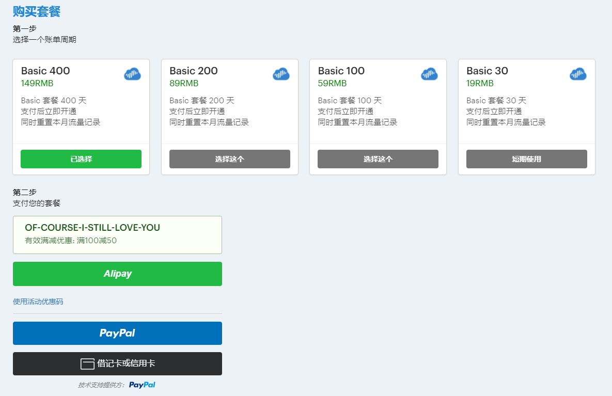
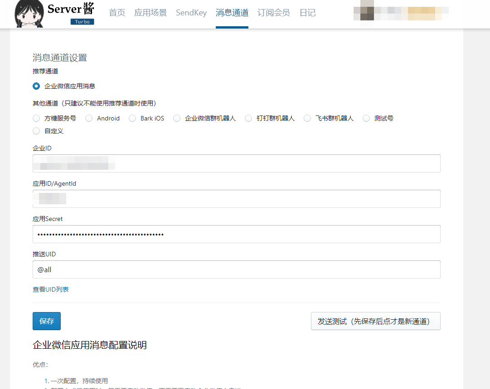

# GLaDOS 梯子 和 自动每日签到

- [GLaDOS 梯子 和 自动每日签到](#glados-梯子-和-自动每日签到)
  - [重要说明](#重要说明)
  - [自动签到说明](#自动签到说明)
  - [GLaDOS](#glados)
    - [注册](#注册)
    - [套餐](#套餐)
      - [套餐选择](#套餐选择)
    - [梯子使用](#梯子使用)
    - [其他工具](#其他工具)
  - [自动签到 Github Action 使用说明](#自动签到-github-action-使用说明)
    - [Step 1 准备工作](#step-1-准备工作)
      - [1-1. 获取 Telegram bot 的 `token`（不需要消息推送的可以跳过）](#1-1-获取-telegram-bot-的-token不需要消息推送的可以跳过)
      - [1-2. 获取 Telegram bot 所在对话的 `chat_id`（不需要消息推送的可以跳过）](#1-2-获取-telegram-bot-所在对话的-chat_id不需要消息推送的可以跳过)
      - [2-1. 获取 Server 酱的 SendKey（不需要消息推送的可以跳过）](#2-1-获取-server-酱的-sendkey不需要消息推送的可以跳过)
      - [2-2. 配置企业微信推送通道（不需要消息推送的可以跳过）](#2-2-配置企业微信推送通道不需要消息推送的可以跳过)
      - [3. 获取 GLaDOS 账号的 `cookie`](#3-获取-glados-账号的-cookie)
    - [Step 2 Fork 此仓库](#step-2-fork-此仓库)
    - [Step 3 设置仓库 Secrets](#step-3-设置仓库-secrets)
      - [需要添加的 Secrets 如下](#需要添加的-secrets-如下)
      - [填写 Secrets](#填写-secrets)
    - [Step 4 启用Action](#step-4-启用action)
    - [Step 5 查看运行结果](#step-5-查看运行结果)
  - [修改定时任务](#修改定时任务)

GLaDOS 是一家梯子服务商，速度还行，且相对便宜，日常使用足够，在其官网每天签到一次，可以延长一天到期时间，比较不错。

每天手动签到不容易记住，也很麻烦，因此参考了一些其他的项目，遂有此项目进行自动签到。

## 重要说明

- 使用梯子服务的时候，你的数据是交给了对方，因此没有完全安全的操作，所以进行敏感操作的时候需要**慎重**，例如：进行敏感操作时可以关闭代理；或者开启代理软件的白名单模式，例如 Android 的 clash for Android App 里，设置只有指定的应用程序允许通过代理。
- 没有哪一家的梯子服务商敢说自己绝对安全，并且他们的服务器都是有审查和日志记录的，这都是公开的，也是这些服务商们为了自保或者有其他企图（境外敌对势力资助的梯子）。并且当你连上梯子时，你的流量也是要走过电信服务商的服务器的，也是会经过国家的审查的。**使用梯子，不是到了法外之地，网安想查你，分分钟就查到了**，因此不要去做**愚蠢**的事，还以为没人会知道。
- 众所周知，贵的东西不一定好，便宜的东西一定不会多么的好。梯子越便宜，速度带宽就越不稳定，安全风险也越大，这个自己掂量。

## 自动签到说明

**基于 Github Action 每天北京时间第二天的 7 点进行自动签到（UTC 时间23点0分）**，通常会有延迟，不过大多情况下我们并不关心是否准时签到，所以可以使用这个服务。

当然如果你实在想准时的签到，可以自己部署到自己的服务器中使用计划任务（或crond），也可以使用腾讯云、华为云等云计算服务商的云函数产品，通常这些产品都带有计划任务的功能。

本脚本签到成功后，通过 Telegram bot 推送结果消息，当然也可以使用诸如 **server酱** 进行推送，这里以 Telegram bot 和 server 酱为例。

## GLaDOS

> 使用 GLaDOS 掌控您的网络，GLaDOS 提供最快速、最稳定、最安全的端点，让用户放心访问高速国际互联网、Netflix 和隐私。

GLaDos 目前基础套餐最便宜是 19 块钱，30天，200G 流量，100mbps 带宽，3个设备。高级套餐 39 块钱，30天，500G 流量，200mbps 带宽，6个设备。

其官网每天签到一次，可以延长一天到期时间，相当于19块钱可以**一直白嫖**（签到达到一定次数，就不会延长期限了，不过也能白嫖不少时间），这是最重要的。

### 注册

点击这个地址，打开如下页面，进行注册 [GLaDOS项目地址](https://github.com/glados-network/GLaDOS)

点击后，跳转到如下图的网页，是 GLaDOS 的官网

填写邮箱，点击 send passcode to email，登录邮箱，查收验证码，回到网页输入后点击 Register 按钮进行注册

注册后显示激活页面，可以输入激活码，输入后点 Next 注册成功。

**注册时请使用我的邀请码 `D4KAO-KNZVG-TZGUW-YMZ13` 可以相互获得免费天数**

### 套餐

注册后可以免费试用，3天 10G 流量，试用期结束后需要购买套餐，有4个套餐，点击 `商店` tab 可以查看

- Basic 基础版：支持 3 个设备同时在线，一个月 200G 流量，100mbps 的最高带宽，价格是 ￥149 400天
- Pro 专业版：支持 6 个设备同时在线，一个月 500G 流量，200mbps 的最高带宽，价格是 ￥398 400天
- 还有 Team 和 Enterprise 套餐，一般用不到，就不赘述了。

#### 套餐选择

普通上上网，看看 Youtube 视频的，**Basic** 套餐够用了，想要大量下东西的话，200G 流量可能不够，自己可以按需购买或升级。

**购买套餐时，点击使用活动优惠码 `Of-Course-I-Still-Love-You` 可以满100减50**，套餐可以选不同的账单周期，有400天的，有200天的，有100天的，有30天的，价格各不相同。

### 梯子使用

在 GLaDOS 网站的首页，基本有各平台支持设备的选项，点开后均有教程，仔细看看很容易上手。

推荐使用 **clash** 这个客户端，PC Android 上都有应用程序，iPhone 则需要使用 ShadowRocket。

在 GLaDOS 首页，点击 **Clash 客户端** 栏目，里面有程序的下载链接，也有使用教程。

这里我也给出程序官方下载地址，如下：

[PC 下载](https://github.com/Fndroid/clash_for_windows_pkg/releases)

[Android 下载](https://github.com/Kr328/ClashForAndroid/releases)

**iOS** 需要使用美区账号，下载 ShadowRocket（需付费购买），美区账号可以自己购买，也可以联系我，用我的。GLaDOS 网站也有详细的教程可供参考。

### 其他工具

如图

## 自动签到 Github Action 使用说明

购买套餐后，使用本脚本可以自动签到，延长到期时间。这里以 Telegram bot 和 server 酱 的消息通知为例，进行签到成功后的消息推送。

### Step 1 准备工作

Telegram bot 和 Server 酱 两种推送方式，可以任选其一，如果配置了 server 酱的 SendKey，则不进行 Telegram bot 的推送。

#### 1-1. 获取 Telegram bot 的 `token`（不需要消息推送的可以跳过）

Telegram 中，`@BotFather` 创建 bot，然后点击对话中的 API Token 按钮，获取 bot 的 **token**。

> Telegram bot 的 token 是类似 `1xxxxxxxx0:AxxxxxxxxxxxxxxxxxxxxB` 的一串字符串

更详细的操作，网上搜一下，教程很多。

#### 1-2. 获取 Telegram bot 所在对话的 `chat_id`（不需要消息推送的可以跳过）
  
这个 chat_id 是用来指定机器人将消息推送到哪里的.

如果你希望机器人直接给你个人发信息，可以使用 `@userinfobot` 这个bot，向它发送信息可以获取你的个人信息，其中的 id 就是作为等下需要用到的 **chat_id** 使用。

如果你想让 bot 发送消息到群组，需要先将 bot 加入到群组，然后获取该群组的 **chat_id**，网上搜索一下，很多教程。

> Telegram bot 的 chat_id 是类似 `1xxxxxxx0` 的一串数字

#### 2-1. 获取 Server 酱的 SendKey（不需要消息推送的可以跳过）

Server 酱的网站是 [https://sct.ftqq.com/](https://sct.ftqq.com/)

登录后，就是免费账户，每天推送有限额，够用

获取 SendKey [https://sct.ftqq.com/sendkey](https://sct.ftqq.com/sendkey)

#### 2-2. 配置企业微信推送通道（不需要消息推送的可以跳过）

server 酱 网站点击 消息通道 tab，配置详细通道。默认是`方糖服务号`，也就是注册时候扫码的服务号。默认推送的消息是到这个服务号里，推荐使用企业微信的推送通道，需要进行一些配置，网页下方有详细步骤。配置完后点击保存即可。

#### 3. 获取 GLaDOS 账号的 `cookie`

- 打开浏览器，打开 GLaDOS 网站并登陆，找到右上角 `签到` 跳转到签到页面

- 打开 `开发者工具`，快捷键为 F12，`Network` 或 `网络` 标签

- 在签到页面点击签到按钮，相对应的开发者工具 `Network` 标签下会出现 `checkin` 请求。
- 点击该请求，会出现更多信息，找到 `Headers` 里的 `cookie`，右键`copy value` 复制值，这个值，就是接下来设置 仓库 Secrets 时需要用到的

> cookie 的值是类似 koa:sess=xxxxxxxxxxxxxxxx; koa:sess.sig=xxxxxxxxxxxxxxx 的一串字符，前面的 _ga 什么的可以不要

- 如果你有多个账号，可以把你所有账号的 cookie 先另行保存起来，以待后用

### Step 2 Fork 此仓库

Fork 此仓库至你自己的 github 账号下

> 注意：接下来的步骤都是在你自己fork后的仓库下进行操作**

### Step 3 设置仓库 Secrets

在你 Fork 的仓库的 `Settings` 页面，`Secrets` tab 下，点击 `New repository secret` 按钮，添加 Secrets

#### 需要添加的 Secrets 如下

- **SERVER_CHAN** 填 server 酱网站获取到的 `sendKey` (不需要可以不创建或不设置)
- **BOT_CHAT_ID** 填 Telegram bot 所在的 chat_id (不需要可以不创建或不设置)
  - 配置了 SERVER_CHAN，此项可以不配置
- **BOT_TOKEN** 填 Telegram bot 的 token（不需要可以不创建或不设置）
  - 配置了 SERVER_CHAN，此项可以不配置
- **COOKIE_LIST** 填 GLaDOS 账号的 cookie（第一步准备工作中所找到的 cookie）
  - 格式为 JSON 数组，例如：`["koa:sess=xxxxxxxxxxxxxxxx; koa:sess.sig=xxxxxxxxxxxxxxx","koa:sess=xxxxxxxxxxxxxxxx; koa:sess.sig=xxxxxxxxxxxxxxx"]`
  - 如果你只有一个账号，也要填写成数组形式，例如：`["koa:sess=xxxxxxxxxxxxxxxx; koa:sess.sig=xxxxxxxxxxxxxxx"]`

> 注意：密钥名所有字母都是大写

#### 填写 Secrets

Name 处填写 `BOT_CHAT_ID`，Value 处填写 `1xxxxxxx0`，点击 Add secret 既添加成功 `BOT_CHAT_ID`

其他三个 Secrets 类似。

### Step 4 启用Action

1. 点击 `Actions`，再点击 **I understand my workflows, go ahead and enable them**，如果没有请忽略
1. 点击仓库（你自己的），修改除 `imgs` 文件夹和 `README.md` 以外的内容，并进行**提交 + 推送**即可触发 Action 脚本运行

### Step 5 查看运行结果

## 修改定时任务

1. 打开 `.github/workflows/checkin.yml`
2. 修改 `crontab 表达式`

在文件编辑模式下，鼠标放到 crontab 表达式的数字上，就有说明解释，这里不再赘述。

